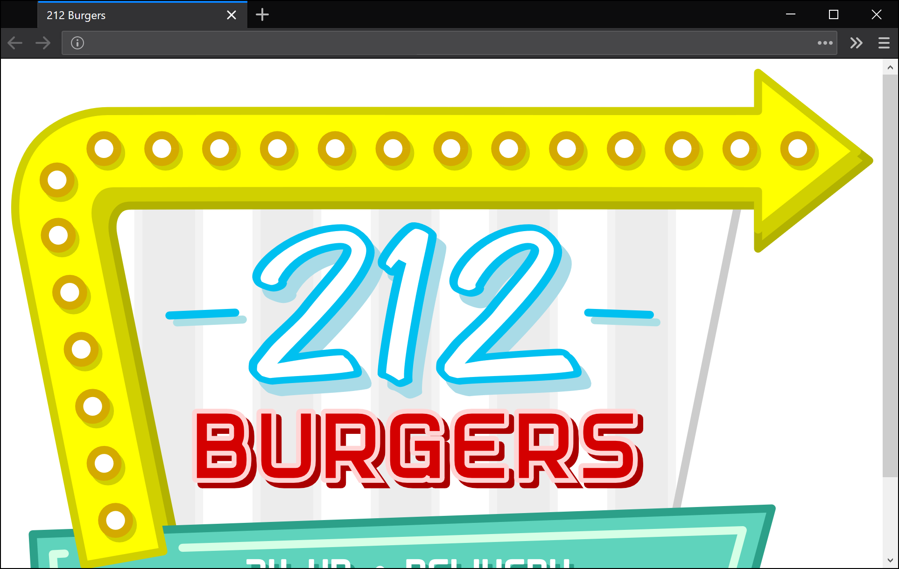
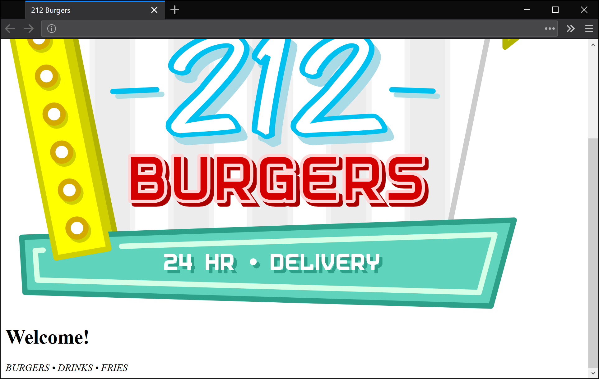
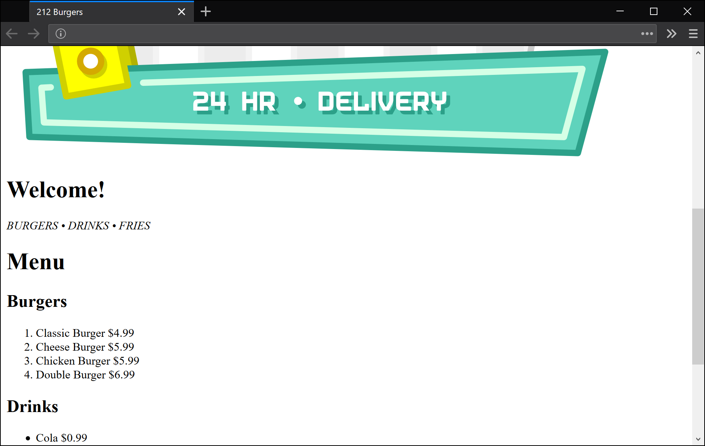
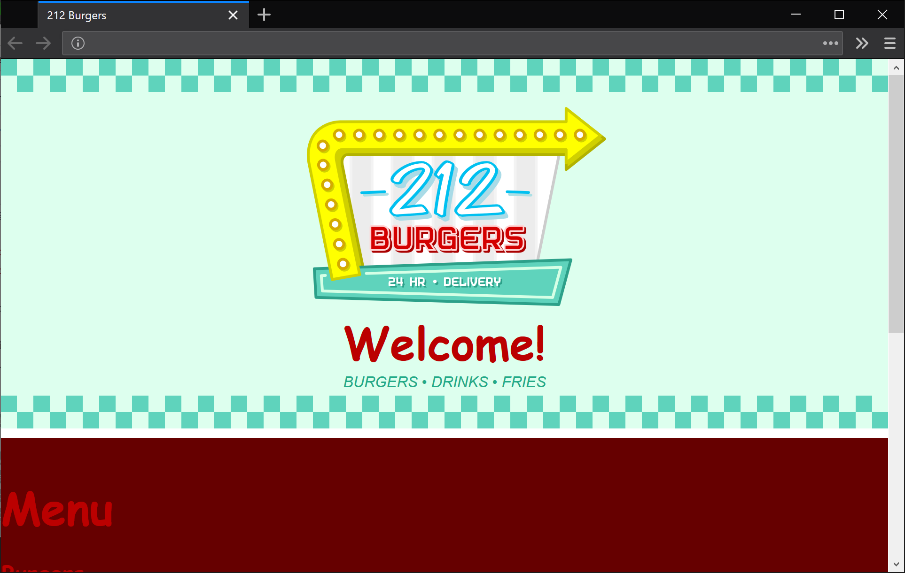
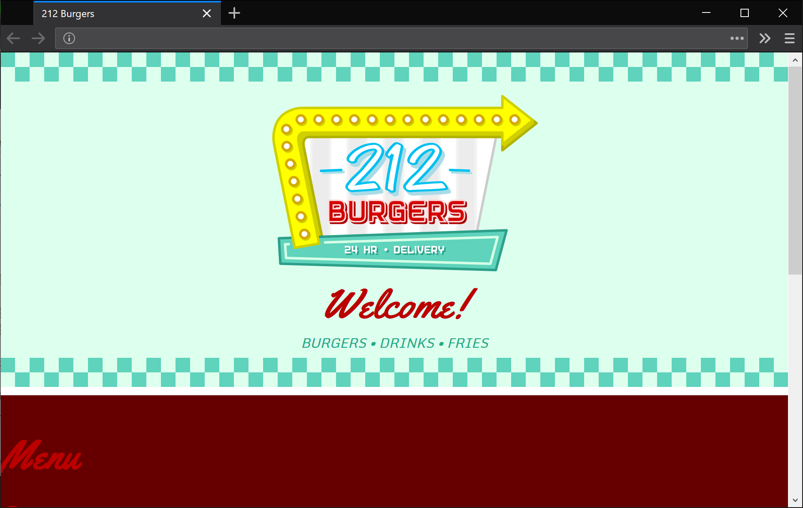
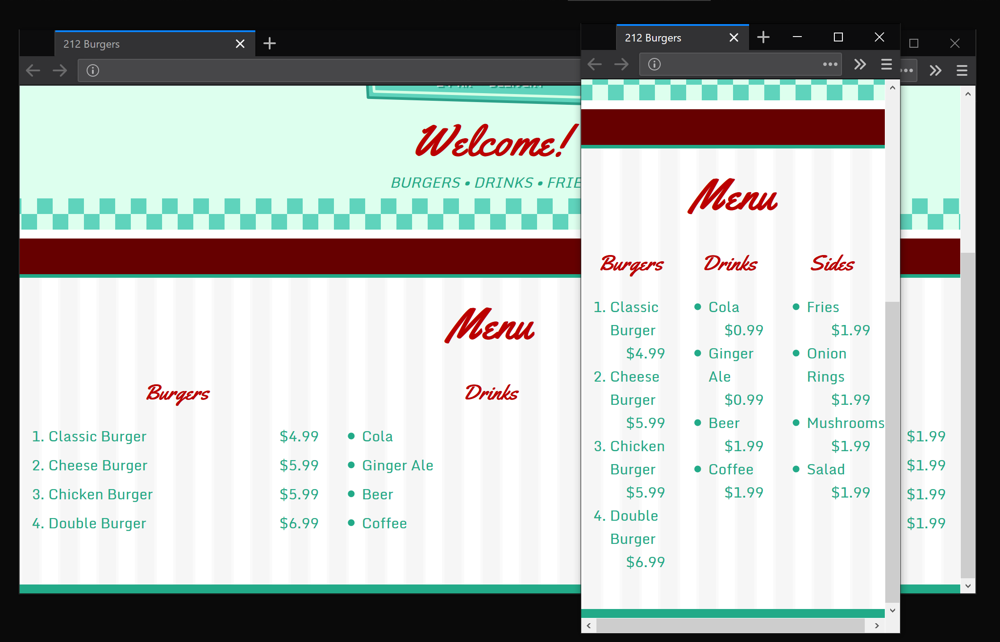
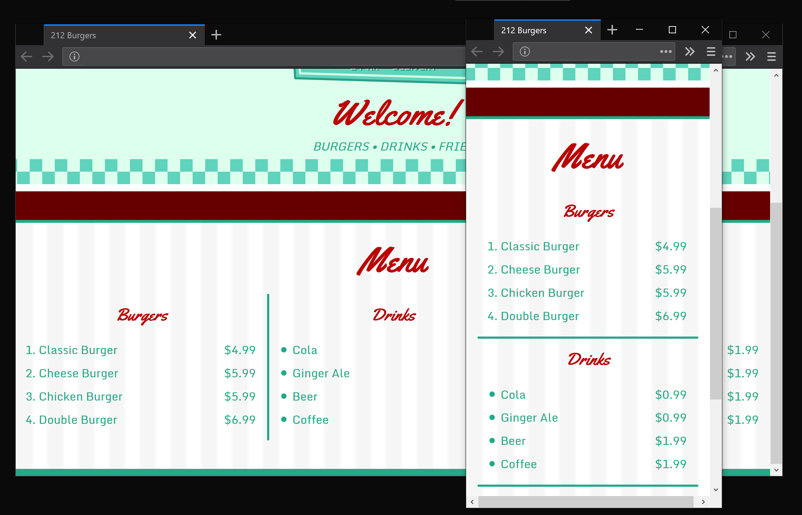
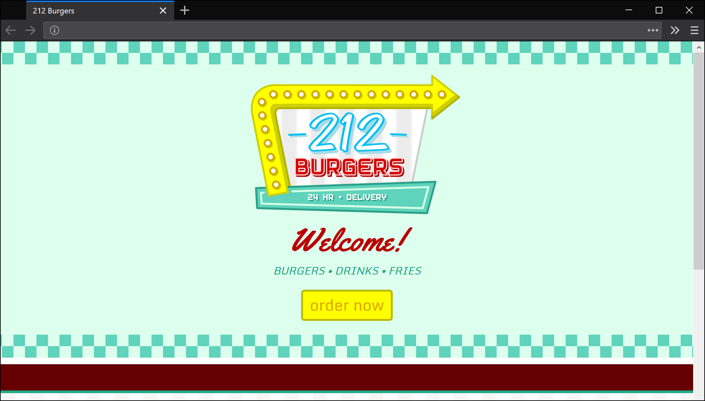

*289.212.01.workshop*

<!-- markdown-pdf -s md.css -h md.js notes.md -m '{"html":true}' -->

HTML & CSS Refresher
====================

This is part one of a multi-lesson task to create a website for ordering fast food (depicted below). You'll use a blend of languages, namely Python (and the Flask framework), HTML, CSS, and SQLite.

If you've no HTML experience or forgot how to write HTML, don't fret. You've been accepted into this course because you're handy with code (and smart). The lecturer will run through this content during the workshops.

These notes provide a cursory overview of the workshop content. They're no substitute for what you'll get out of actually attending, but should prove useful for referencing after the lesson, or if you absolutely cannot make it.

HTML Document Structure
-----------------------

HTML (Hypertext Markup Language) is the language for creating web-pages. HTML documents all share one thing in common: the initial code used to structure them.

Create a new directory named "212-Burgers". Open up your preferred code editor (Atom? Brackets? other?); create a new file; and save it as "index.html" (in your 212-Burgers directory). Now add the following code:

~~~html
<!DOCTYPE html>

<html>

  <head>

    <meta charset="utf-8">
    <title>212 Burgers</title>
    <meta name="description" content="24 hour food delivery. Order burgers, drinks, fries, and more!" />
    <meta name="viewport" content="width=device-width, initial-scale=1, shrink-to-fit=no">

  </head>

  <body>

  </body>

</html>
~~~

Every HTML document will begin something like this. Of course, you'll change the `<title>` and `<meta name="description" ...` information for each project.

Save, then open the *index.html* file in your web browser. It's a blank page for now, but we'll add some content in a moment. Keep the page open in your browser so that you can refresh it as you make changes.

For an explanation on how HTML syntax works, you can refer to Mozilla's developer documentation:  
https://developer.mozilla.org/Learn/HTML/Introduction_to_HTML/Getting_started

Images
------

Grab the *289.212.01.files* download from Stream. You'll find three SVG images in that zip archive. SVG images are vector-based, so no matter how large you render them, they won't pixelate. Add the images to your *212-Burgers* directory (so that they sit alongside your *index.html* file).

Now add an `img` (image) tag to your `body` element. The `src` attribute points to the *logo.svg* file:

~~~
  ...

  <body>
    
  </body>

</html>
~~~

Save your code, then refresh your web browser:

Okay, so the logo is there. It's clearly oversized, but we'll address this shortly.

Block- and Inline-Level Elements
--------------------------------

Elements like `div` and `h1` are block-level elements; they'll sit on their own 'line' rather than alongside something else. The emphasis element (`em`) makes text italic; it's an inline-level element.

Add a heading and italic line:

~~~
  ...

  <body>

    

      
      <h1>Welcome!</h1>
      <em>BURGERS &bull; DRINKS &bull; FRIES</em>

    

  </body>

</html>
~~~

The `id="..."` *attributes* will come in handy later when we add some CSS.

The `&bull;` renders a bullet character. Many characters in HTML -- like `<`, `>`, or `&` -- are reserved for syntax; you substitute them for a code known as an *entity*. For a list of these entities refer to the following link:

https://developer.mozilla.org/Glossary/Entity

Now add a menu that uses a mix of elements:

~~~
  ...

  <body>

    

      
      <h1>Welcome!</h1>
      <em>BURGERS &bull; DRINKS &bull; FRIES</em>

    

    

      <h1>Menu</h1>

      

        <h2>Burgers</h2>
        <ol class="menu-items">
          <li>Classic Burger $4.99</li>
          <li>Cheese Burger $5.99</li>
          <li>Chicken Burger $5.99</li>
          <li>Double Burger $6.99</li>
        </ol>
      

      

        <h2>Drinks</h2>
        <ul class="menu-items">
          <li>Cola $0.99</li>
          <li>Ginger Ale $0.99</li>
          <li>Beer $1.99</li>
          <li>Coffee $1.99</li>
        </ul>
      

      

        <h2>Sides</h2>
        <ul class="menu-items">
          <li>Fries $1.99</li>
          <li>Onion Rings $1.99</li>
          <li>Mushrooms $1.99</li>
          <li>Salad $1.99</li>
        </ul>
      

    

  </body>

</html>
~~~

For more control over the appearance of our elements, you'll employ CSS.

CSS
---

CSS (Cascading Style Sheets) is a language that works hand-in-hand with HTML to style HTML elements.

Create a new file named *screen.css*. Save it in the same 212-Burgers directory as all of your other files. Add the following code to the new *screen.css* file:

~~~
/* id selector (one-off items) */

#logo {
  padding-left: 25px;
  width: 320px;
}

#header {
  background-color: #DFE;
  background-image: url(checks.svg), url(checks.svg);
  background-position: top, bottom;
  background-repeat: repeat-x;
  background-size: 35px;
  border-bottom: white 10px solid;
  margin-bottom: 40px;
  padding-top: 50px;
  padding-bottom: 40px;
  text-align: center;
}
~~~

**Note** that CSS comments are opened with a `/*` and closed with a `*/`.

Recall that you have an `id="..."` attribute on your `
` and `` elements. Any CSS rule beginning with a `#` will match elements with a corresponding `id` attribute. But, you have yet to link *screen.css* to the *index.html* file. Add a `link` line to the `head` element:

~~~
...

  <head>

    ...
    <link rel="stylesheet" href="screen.css" />

  </head>
~~~

Ensure that you save both files. Refresh your browser.

To style elements with no `id` attribute, use selectors named after the tag itself (with no `#`). Add the following code to your screen.css:

~~~
/* tag selectors */

body {
  background-color: #600;
  color: #2A8;
  font-family: 'Monda', sans-serif;
  margin: 0;
}

h1 {
  color: #B00;
  font-family: 'Yellowtail', cursive;
  font-size: 3em;
  margin: 0;
}

h2 {
  color: #B00;
  font-family: 'Yellowtail', cursive;
}

a {
  color: #DA0;
  text-decoration: none;
}
~~~

It's getting closer, but, among other issues, the fonts are wrong. You'll have noticed that the font-families `'Monda'` and `'Yellowtail'` referenced in the CSS. But your computer (and that of your visitor's) is unlikely to have those fonts installed. However, they're both available in the Google fonts collection. To load them, add the following lines *to the top* of your CSS file:

~~~
/* google font import */

@import url('https://fonts.googleapis.com/css?family=Monda');
@import url('https://fonts.googleapis.com/css?family=Yellowtail');

...
~~~

Looking good! Time to get the menu layout sorted.

CSS Box Model
-------------

The *CSS Box Model* is the basis of layout for the web. You can think of your content arranged in boxes, which you position for your desired layout.

For more information on the box model, you can refer to the relevant Mozilla documentation:  
https://developer.mozilla.org/Learn/CSS/Introduction_to_CSS/Box_model

Add the following CSS code to style your menu, paying attention to any `padding`, `border`, and `margin`, and how those properties affect the block-level elements you target:

~~~
...

#menu {
  background-color: white;
  background-image: url(menu-bg.svg);
  background-size: 46px;
  border-bottom: #2A8 10px solid;
  border-top: #2A8 4px solid;
  display: grid;
  margin: auto;
  max-width: 1140px;
  padding: 20px 0;
  padding-bottom: 2.5em;
  grid-template-columns: 1fr 1fr 1fr;
  grid-template-rows: auto;
}

/* descendant selectors */

#menu h1 {
  grid-column: span 3;
  padding-bottom: 0.3em;
  text-align: center;
}

#menu h2 {
  margin-top: 0.5em;
  text-align: center;
}

#menu ol,
#menu ul {
  padding-left: 2em;
}

#menu li {
  margin-top: 0.4em;
  width: 100%;
}

#menu .price {
  float: right;
  padding-right: 1em;
}
~~~

In this case, you're using a CSS `grid` layout to get the lists sitting alongside one another. CSS frameworks -- such as [Bootstrap](https://getbootstrap.com/) or [Skeleton](http://getskeleton.com/) -- could also work for this job.

The following CSS rule is useful if you wish to visualise the boxes:

~~~
* {
  outline: 1px rgba(255,0,0,0.1) solid;
}
~~~

You can add this to the top of your *screen.css* file to draw outlines around all of your HTML elements.

Media Queries
-------------

Things get messy when you resize your browser:

This means that your website isn't much good for mobile devices, and this is where [media queries](https://developer.mozilla.org/Web/CSS/Media_Queries) prove handy.

Add the following code to your CSS document:

~~~
...

#menu div {
  grid-column: span 3;
  margin: 0 1em;
}

#menu div:nth-child(3) {
  border-bottom: 3px solid #2A8;
  border-top: 3px solid #2A8;
}

/* media query */

@media only screen and (min-width: 720px) {

  #menu div {
    grid-column: auto;
    margin: 0;
  }

  #menu div:nth-child(3) {
    border: none;
    border-left: 3px solid #2A8;
    border-right: 3px solid #2A8;
  }

}
~~~

The CSS above the `/* media query */` comment targets mobile, while the code within the `@media` block targets screens over 720 pixels wide. The layout now switches between three-column and single-column arrangements as you resize the browser window:

It's important to note that the `<meta name="viewport" ...` line in the `<head>` of your document is vital to get this behaviour working properly on mobile devices. If you leave that line out, the webpage will scale-to-fit rather than re-flow.

Links
-----

A website isn't really a website unless you can click on stuff!

Create a new file named *order.html*; save it in the same *212-Burgers* directory as the rest of your project files. Add the following code to the *order.html* file:

~~~
<!DOCTYPE html>

<html>

  <head>

    <meta charset="utf-8">
    <title>212 Burgers</title>
    <meta name="description" content="Order - 24 hour food delivery. Order burgers, drinks, fries, and more!" />
    <meta name="viewport" content="width=device-width, initial-scale=1, shrink-to-fit=no">
    <link rel="stylesheet" href="screen.css" />

  </head>

  <body>

    

      <h1>Order now</h1>
      
PLACE YOUR ORDER

    

  </body>

</html>
~~~

**Note** that this webpage shares a CSS file with *index.html*. This allows you to reuse CSS across many webpages, and provides a handy way to make site-wide changes in one place. 

To link to this new order.html page, go back to your index.html code and add a paragraph (`
`) with a nested link (`<a>`) element:

~~~
  ...

    

      
      <h1>Welcome!</h1>
      <em>BURGERS &bull; DRINKS &bull; FRIES</em>
      

        <a class="btn-yellow" href="order.html">order now</a>
      

    ...
~~~

Now add the following code to your CSS file:

~~~
/* button */

.btn-yellow {
  background-color: #FF0;
  border: 3px solid #BB0;
  border-radius: 5px;
  color: #DA0;
  cursor: pointer;
  display: inline-block;
  font-size: 1.5em;
  padding: 0 10px 2px 10px;
  transition: background-color 0.5s;
  transition: color 0.5s;
}

.btn-yellow:hover {
  color: #FF0;
  background-color: #DA0;
  text-decoration: none;
  transition: background-color 0.5s;
  transition: color 0.5s;
}
~~~

This code includes a hover effect. That is, when you mouse-over the button, there's some animation. Test this out and confirm that the button directs to the order page.

Footer
------

Finally, add the footer to your index.html file:

~~~
    ...

    

      disclaimer
    

  </body>

</html>
~~~

-- as well its CSS:

~~~
#footer {
  color: white;
  font-size: 0.8em;
  opacity: 0.4;
  padding: 1em;
  text-align: center;
}
~~~

That's it for workshop 01.

HTML and CSS References
-----------------------

These links will prove handy while you're working with HTML and CSS:

* https://developer.mozilla.org/Web/HTML/Element
* https://developer.mozilla.org/Web/CSS/Reference

*end*
