*289.212.02.workshop*

<!-- markdown-pdf -s md.css -h md.js notes.md -m '{"html":true}' -->

Version Control
===============

Your lecturer will introduce version control, explaining why it's essential for programming projects. In addition to recording a history of your changes -- and synchronising them to the cloud -- it makes collaboration for developers far more manageable.

For version control, you'll use GitHub Desktop. This is a free, multi-platform application that integrates with [github.com](https://github.com). Download it here:

https://desktop.github.com/

When running GitHub Desktop for the first time, it'll prompt you to enter your GitHub account details. If you don't have an account, sign-up for a free one at:

https://github.com/

Once you're done installing Github Desktop, there'll be a few start-up steps to connect GitHub Desktop to your github.com account. When that's complete, select **File > New Repository...**

In the modal that appears (depicted below):

1. in the *Name* field, enter `212-Burgers`;
2. in the *Description* field, enter `Flask-based website`;
3. choose a *Local Path* where you prefer to work (i.e. your Desktop);
4. check/tick the README option;
5. for the *Git Ignore*, select Python;
6. do not worry about a license;
7. click **Create Repository**.

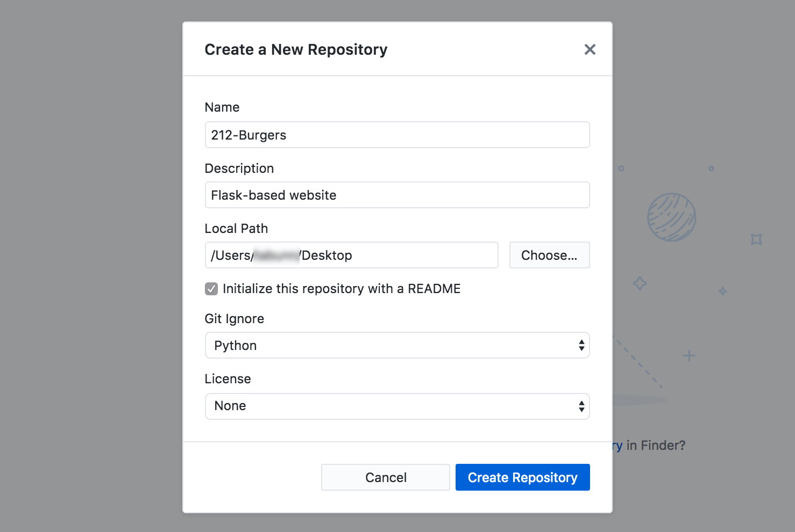

Place last week's class files in the new 212-Burgers directory (on your Desktop?). If you've done this correctly, the changes will reflect in the GitHub Desktop *Changes* list (the left panel in the application interface).

Now:

1. add a commit *Summary*;
2. click **Commit to master**;
3. then **Publish repository**.

See the image below for the operations that correspond to each of the above-listed steps.

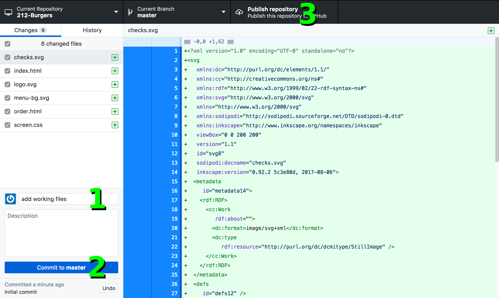

This will 'sync' your changes to the github.com server. You can verify this has worked on the github.com website. Open your web browser and head over to https://github.com/**your_account_name**. Navigate to the repository named *212-Burgers* to view your files.

You need not Publish/Push each time you commit, but ensure that you do this upon finishing your work session (i.e. leaving the classroom, office, or coffee shop) so that your changes are pushed to the cloud.

Command Line
============

The command line looks intimidating, but knowing the basics will prove very useful for development work. Linux, Mac, and Windows all include some *terminal*/command-line environment. These notes will use the Mac terminal; if you're using Windows, the application you'll open is named *Command Prompt*. The commands for Windows are slightly different than Mac/Linux, but I'll try to note what these differences are.

Open the *Terminal* app (`command + spacebar`, then type `Terminal`). On Windows, open the *Command Prompt*. The Mac Terminal application is depicted below:

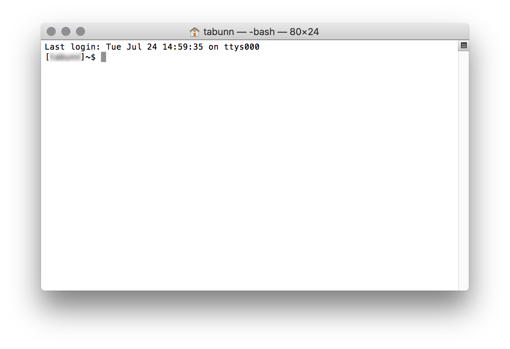

The prompt (`[user]~$`) will vary depending on your settings and system, but this is not important. You may have a white-on-black colour scheme (Windows), but most terminals allow one to customise the colours.

Now try your first command -- type `ls` (or, on Windows `dir`). This will display some list of files, something like the image below:

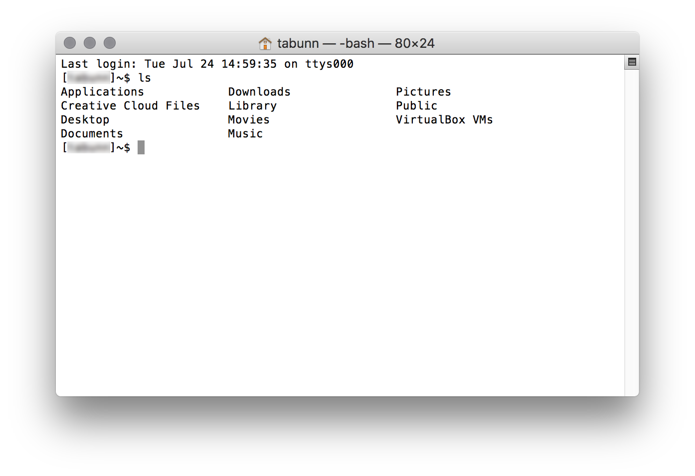

To switch to your *212-Burgers* directory, type `cd ` (with a space character at the end), then drag the *212-Burgers* folder to into the terminal. This will insert a path for you; hit the enter key.

You can confirm that you're in the *212-Burgers* directory by listing your files:

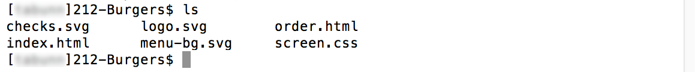

Note how the `ls` command lists the contents of the directory you're currently 'in'. 

You can use `cd ..` to enter the parent directory (go a folder up). As you've probably guessed, the `cd` command performs a <b>c</b>hange <b>d</b>irectory. To change back to your *212-Burgers* directory, you can use `cd 212-Burgers`.

Virtual Environments
====================

Python's virtual environment feature takes the headache out of working with different versions of Python and Python libraries. But first, you'll need to install Python 3.

Installing Python 3
-------------------

*This step is not necessary on the Massey machines, as Python has been pre-installed for you.*

You can download the latest version of Python from the python.org website:

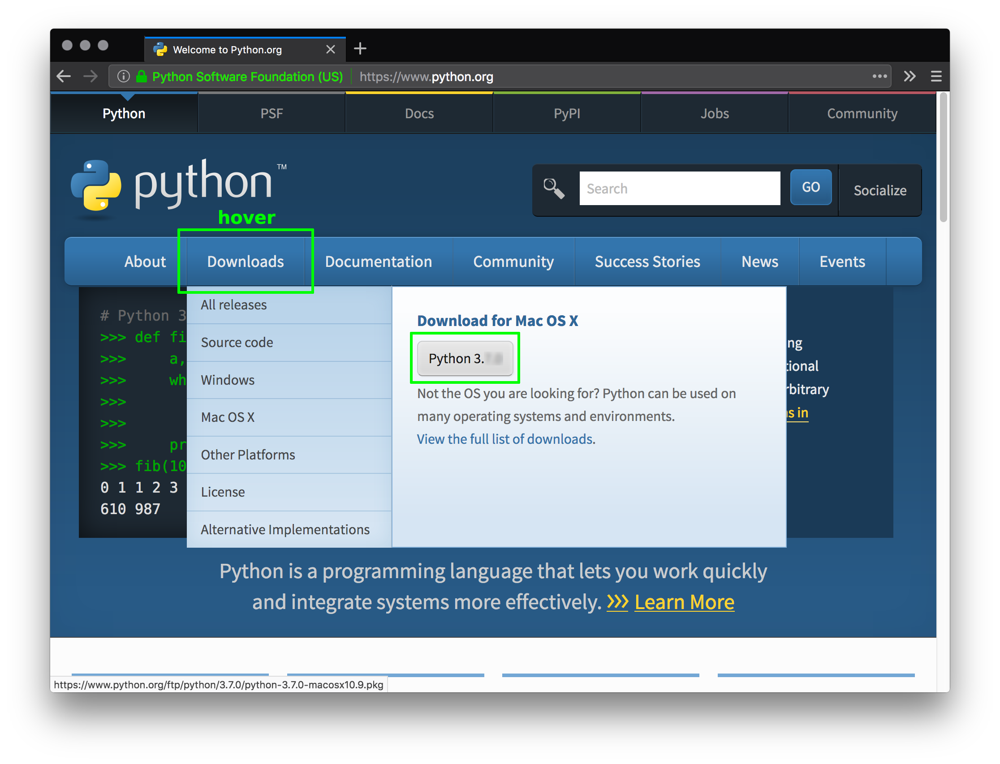

Once downloaded, run the installer.

Setting Up a Virtual Environment
--------------------------------

With your command line ready and waiting in the `212-Burgers` directory, type in the following command:

~~~
python3 -m venv env
~~~

Or, on Windows:
~~~
py -m venv env
~~~

This will create a new directory named `env`. The `env` directory will contain your virtual environment files (all of the additional libraries you install, like Flask for this project). You need to activate this using:

~~~
source env/bin/activate
~~~

Or, on Windows:
~~~
env\Scripts\activate.bat
~~~

You should now see an `(env)` in front of your prompt.

Python, by default, does not include Flask; to install it, enter:

~~~
pip install flask
~~~

Flask Application Structure
---------------------------

Great! You're ready to run Flask ... almost.

Create a new file in your editor (Atom?), and save it in your `212-Burgers` directory as `run.py`. Add the following code:

~~~python
from flask import Flask
app = Flask(__name__)

@app.route('/')
def index():
    return('<h1>hello world</h1>')
~~~

To explain the above:  
* the `from flask import Flask` line imports the components you require;
* the `app = Flask(__name__)` line creates a new app instance;
* the rest is responsible for serving up a landing page.

In the terminal, you'll need to set two environmental variables using the following commands:

~~~
export FLASK_APP=run.py
export FLASK_DEBUG=1
~~~

Or, on Windows, use `set` instead of `export`:

~~~
set FLASK_APP=run.py
set FLASK_DEBUG=1
~~~

Now run your app server using:

~~~
flask run
~~~

Or, on Windows:
~~~
py -m flask run
~~~

The server will report that it's running, via some output like this:

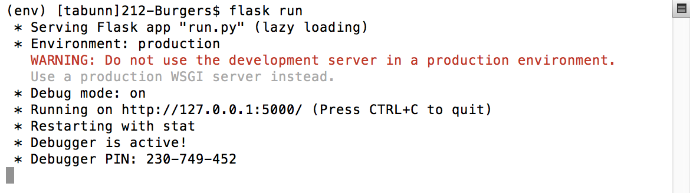

You can enter `http://127.0.0.1:5000` into your browser to see the result.

`127.0.0.1` points to your computer, which is now acting as a web server. Alternatively, you can use `http://localhost:5000`

Now is a good point to commit your changes (using GitHub Desktop).

Flask Templates
===============

Flask employs the *Jinja2* library for website templating. Jinja2 allows you dice-up your HTML code into reusable components (i.e. a reusable header, footer, etc.). This is useful because it saves you having to repeat the same code in multiple HTML files.

Rendering
---------

By default, Flask expects that template files are placed in a directory named *templates*. Create a "templates" directory and move the .html files into it (leaving images, css, etc. behind). The image below conveys the directory structure:

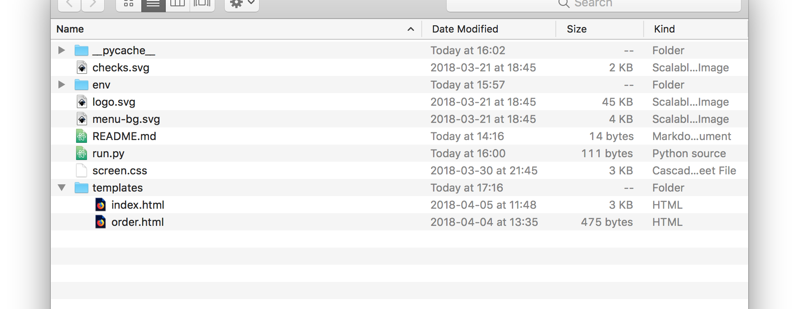

Now edit the *run.py* code, adding `render_template` to the import (first) line and adjusting the `return` line:

~~~python
from flask import Flask, render_template
app = Flask(__name__)

@app.route('/')
def index():
    return render_template('index.html')
~~~

Check your browser. Things work, kind of.

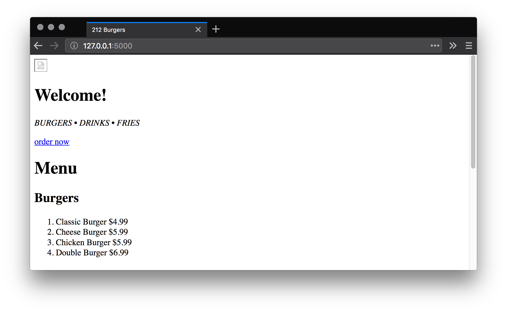

Don't worry! We'll fix the broken images and stylesheet shortly.

Template Variables
------------------

Next, you'll pass a variable into the template by including it as an argument for the `render_template` function:

~~~python
...
    return render_template('index.html', disclaimer='may contain traces of nuts')
~~~

To display the disclaimer, add a template variable to the *index.html* file:

~~~html
    ...

    

      {{ disclaimer }}
    

  </body>

</html>
~~~

Refresh your browser and verify that the disclaimer is displaying.

Filters
-------

Add an `upper` filter to the disclaimer variable so that it displays in uppercase:

~~~html
    ...

    

      {{ disclaimer|upper }}
    

  </body>

</html>
~~~

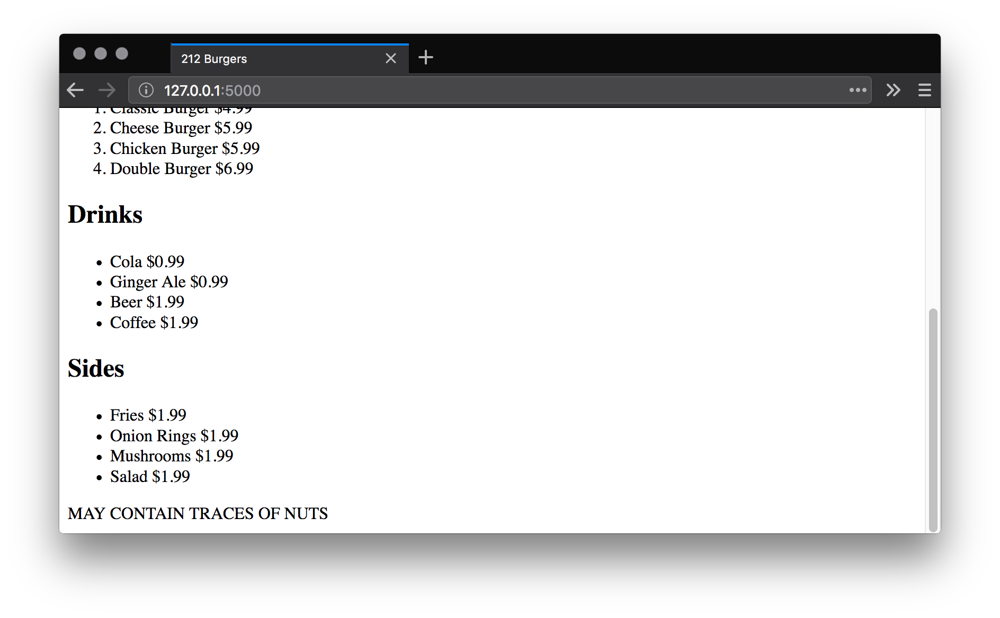

There are various filters available, including `lower`, `title`, `capitalize`, and `trim`. You can refer to the relevant documentation for more info: https://jinja.palletsprojects.com/en/master/templates/#list-of-builtin-filters

Control Structures
------------------

You can use control structures to control how and what your templates display. For example, to reveal a `
` if a certain condition is met, to repeat a `
` several times over, and so forth.

Add a new burgers list to your *run.py* code:

~~~python
from flask import Flask, render_template
app = Flask(__name__)

burgers = [
 'Classic Burger $4.99',
 'Cheese Burger $5.99',
 'Chicken Burger $5.99',
 'Double Burger $6.99'
]

...
~~~

Then pass the list to your template:

~~~python
...

@app.route('/')
def index():
    return render_template('index.html', 
                            disclaimer='may contain traces of nuts', 
                            burgers=burgers)
~~~

In this case, you'll need the template to loop through the list of items the `burgers` variable holds, repeating some HTML code for each value. Edit your *index.html* file:

~~~html
    ...

    

      <h1>Menu</h1>

      

        <h2>Burgers</h2>
        <ol class="menu-items">
          
          <li>{{ burger }}</li>
          
        </ol>
     

     

       <h2>Drinks</h2>
       ...
~~~

There's a problem, though: you've removed all of the `` elements. Each `burgers` list item contains both the item name and item price. The item name and price, however, should not be stored in the same Python string. This requires a list of lists. 

Replace the following code in each file and read through it, comparing what you had before to make sense of what is going on:

*run.py*
~~~python
from flask import Flask, render_template
app = Flask(__name__)

burgers = [
 ['Classic Burger', '$4.99'],
 ['Cheese Burger', '$5.99'],
 ['Chicken Burger', '$5.99'],
 ['Double Burger', '$6.99']
]

...
~~~

*index.html*
~~~html
    ...

    

      <h1>Menu</h1>

      

        <h2>Burgers</h2>
        <ol class="menu-items">
          
          <li>{{ burger[0] }} {{burger[1]}}</li>
          
        </ol>
     

     

       <h2>Drinks</h2>
       ...
~~~

The result will appear visually the same -- but when you re-connect the stylesheet, the price is wrapped with its own class and can, therefore, be targeted separately by CSS (to right-align it). More on the CSS shortly, though.

Now give the *Drinks* and *Sides* the same treatment -- creating a Python list for each group and replacing the existing HTML with `{% for ...` structures.

Links and Static files
----------------------

*Static* files are those which require no processing. For example, images are simply served-up without Flask having to replace any variables or other code. However, you must redirect your asset paths (`src` and `href` attributes) to comply with Flask's system for serving static assets.

Create a new directory named *static*. Move your CSS and graphics files into this (any JS files would, hypothetically, reside in here too).

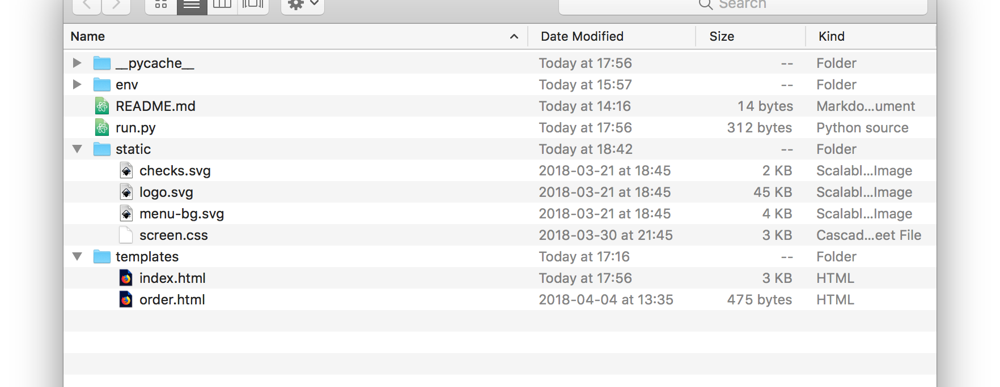

Now amend the CSS path in your *index.html* document:

~~~html
<!DOCTYPE html>

<html>

  <head>

    ...
    <link rel="stylesheet" href="{{ url_for('static', filename='screen.css') }}" />

  </head>

  ...
~~~

Take note of the syntax -- in particular, how the file name is specified using a `filename='...'` argument. This reconnects the stylesheet, but the image logo path is still broken:

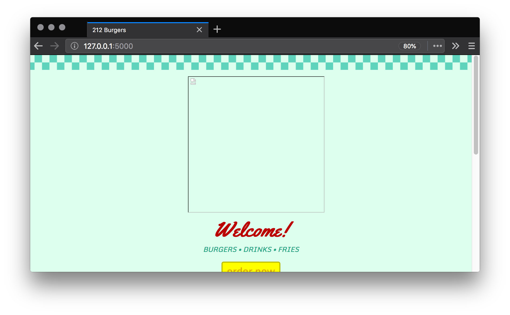

See if you can restore the logo image.

Inheritance
-----------

Templates can inherit from other templates. For example, if you have a "contact" page that exactly resembles your website's landing page, except for a few modifications, then you can use the landing page as a template for your contact page.  

In this case, you'll create an "order" page that inherits all of the features of the landing page. Of course, you'll make changes to the order page's content to distinguish it from your landing page.

First, add a new static link to the landing page:

~~~html
  ...

    

      
      <h1>Welcome!</h1>
      <em>BURGERS &bull; DRINKS &bull; FRIES</em>
      

        <a class="btn-yellow" href="{{ url_for('order') }}">order now</a>
      

    ...
~~~

The `url_for('order')` will automatically insert the route that matches `order` (the path to the order page). But, as this route has yet to be defined, Flask will throw an error. We'll fix that shortly.

Now, you'll need to dice-up your HTML code into sensible template components. Create an empty new file and save it in the *templates* directory as *base.html*. Copy and paste in the following code:

~~~html
<!DOCTYPE html>

<html>

  <head>
    
    <meta charset="utf-8">
    <title></title>
    <meta name="description" content="24 hour food delivery. Order burgers, drinks, fries, and more!" />
    <meta name="viewport" content="width=device-width, initial-scale=1, shrink-to-fit=no">
    <link rel="stylesheet" href="{{ url_for('static', filename='screen.css') }}" />
    
  </head>

  <body>

     blah blah 

    
    

      {{ disclaimer|upper }}
    

    

  </body>

</html>
~~~

What you should note about the above code is that it's actually the *index.html* code **with all of the body content stripped out**. In place, I've added a few other template elements, namely those beginning with `{% block ...`

Here's the template code to add to your *order.html* file:

~~~html


Order - 212 Burgers


    {{ super() }}
    



    

      <h1>Order now</h1>
      
PLACE YOUR ORDER

    


~~~

Note how the first line indicates that this file extends upon the `"base.html"` template. Wherever you see `{% block ...`, the corresponding template code replaces the code within -- unless there's a `{{ super() }}`, in which case it's appended/added to the template you're extending.

Now add the following new route to *run.py*:

~~~python
...

@app.route('/order')
def order():
    return render_template('order.html')
~~~

Type `127.0.0.1:5000/order` into the browser address bar and observe the result:

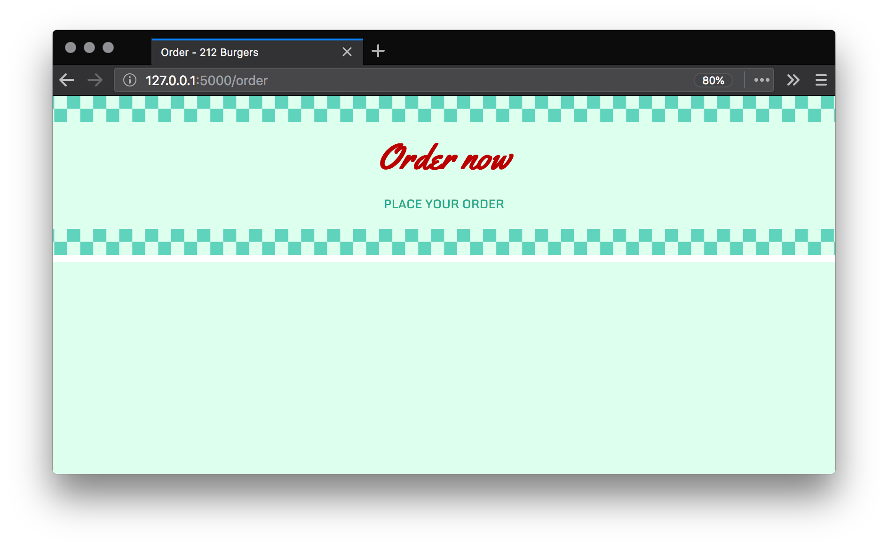

What's more interesting is the source code. Right-click in your browser window and select **View Page Source**:

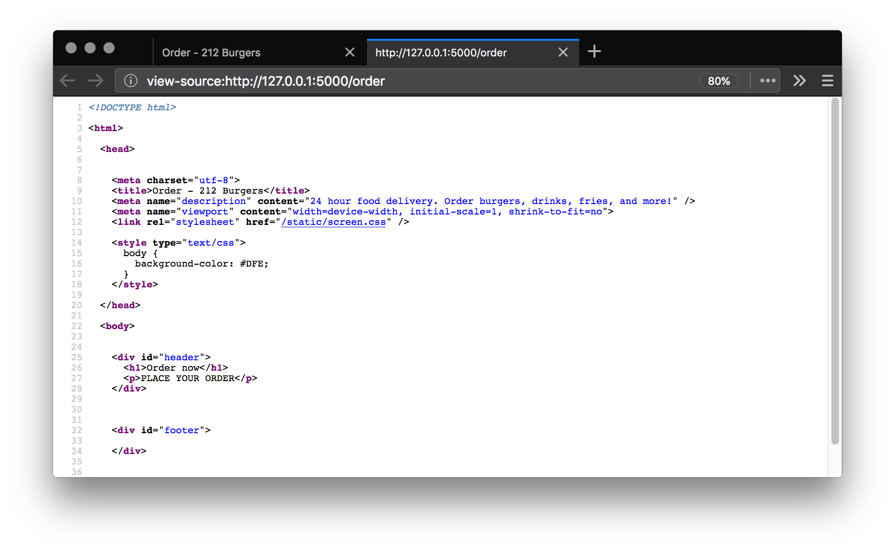

Study this to understand how Flask has replaced the `{% block ...` code.

Now strip out what you don't need in the *index.html* file, inheriting what you can from the *base.html* template instead. This leaves you with the following code:

*index.html*
~~~html


212 Burgers


    

      
      <h1>Welcome!</h1>
      <em>BURGERS &bull; DRINKS &bull; FRIES</em>
      

        <a class="btn-yellow" href="{{ url_for('order') }}">order now</a>
      

    

    

      <h1>Menu</h1>

      

        <h2>Burgers</h2>
        <ol class="menu-items">
          
          <li>{{ burger[0] }} {{ burger[1] }}</li>
          
        </ol>
      

      

        <h2>Drinks</h2>
        <ul class="menu-items">
          
          <li>{{ drink[0] }} {{ drink[1] }}</li>
          
        </ul>
      

      

        <h2>Sides</h2>
        <ul class="menu-items">
          
          <li>{{ side[0] }} {{ side[1] }}</li>
          
        </ul>
      

    


~~~

In Closing
==========

In future, to run your Flask server, use the following sequence of terminal commands:

*Mac/Linux*
~~~
cd *DRAG PROJECT FOLDER INTO TERMINAL*
source env/bin/activate
export FLASK_APP=run.py
export FLASK_DEBUG=1
flask run
~~~

*Windows*
~~~
cd *DRAG PROJECT FOLDER INTO TERMINAL*
env\Scripts\activate.bat
set FLASK_APP=run.py
set FLASK_DEBUG=1
py -m flask run
~~~

Of course, the `cd` line will vary depending on the location of your project files.

Do not forget to commit and push your changes (using GitHub Desktop).

For more on Flask's functions and features, refer to the documentation:  
https://flask.palletsprojects.com

*end*
