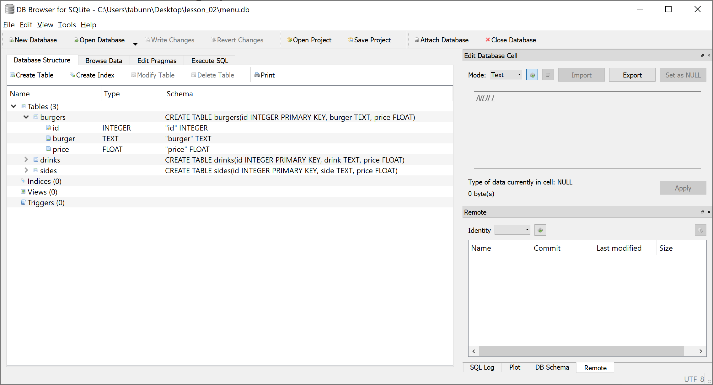

*289.212.03.workshop*

<!-- markdown-pdf -s md.css -h md.js notes.md -m '{"html":true}' -->

SQLite
======

SQLite is a lightweight *relational database management system* (RDBMS) that operates much like any other SQL-type RDBMS. However, it's far quicker to get up-and-running than many of the alternatives (MySQL, Oracle, Postgres, etc.) because it runs from a single file and requires no server configuration.

Your lecturer/tutor will cover SQL solutions in more detail -- as well as some NoSQL -- but to summarise:

* **SQLite pros:** server-less; cross-platform; self-contained; single-file; open-source.
* **SQLite cons:** moderate transaction rates; not suited to *massive* datasets; lack of database-level access control; no native network access (it's server-less); no real-time replication.

SQLite is available on many platforms, including Windows, Mac, and Linux. It's also built into many other apps, such as your web browser.  

Macs come with SQLite pre-installed. To install SQLite on you personal Windows computer, you can download it at [https://sqlite.org/download.html](https://sqlite.org/download.html). To install it, you can follow these instructions: [https://www.tutorialspoint.com/sqlite/sqlite_installation.htm](https://www.tutorialspoint.com/sqlite/sqlite_installation.htm)

Creating a Database
-------------------

Open the terminal and `cd` to your web app directory (*212-Burgers*). If you're already running a Flask server in your terminal, you can open a second terminal window for this new operation.

Create a new SQLite database named *menu.db* using the following command:

~~~
sqlite3 menu.db
~~~

The prompt should now change to that of SQLite (`sqlite> ...`). The next step is to create a new database *table* for the burger items. By convention, I write all SQL terms in uppercase (like `CREATE TABLE`), but this is optional and you can use lowercase if you wish; this is to help distinguish SQL commands from names you define.

~~~
CREATE TABLE burgers(
  id INTEGER PRIMARY KEY,
  burger TEXT UNIQUE,
  price FLOAT NOT NULL
);
~~~

This creates a new table with three columns:

* The `id` column holds an `INTEGER` that serves as the `PRIMARY KEY`; it will automatically increment with each new record inserted. This ensures that every `id` value is unique.
* The `burger` column holds a `UNIQUE` text value (i.e. no duplicate burger names are permitted).
* the `price` column holds a `FLOAT` (floating-point) value, and null/empty values are not permitted (`NOT NULL`).

One refers to `INTEGER`, `TEXT`, and `FLOAT` as [*data types*](https://www.tutorialspoint.com/sqlite/sqlite_data_types.htm). `PRIMARY KEY`, `UNIQUE`, and `NOT NULL` are [*constraints*](https://www.tutorialspoint.com/sqlite/sqlite_constraints.htm).

Next, insert a single burger entry:

~~~
INSERT INTO burgers(burger, price) VALUES ('Classic Burger', 4.99);
~~~

You may wrap this line over multiple lines if it helps you. The semicolon (`;`) marks the end of any query:

~~~
INSERT INTO burgers(burger, price)
VALUES ('Classic Burger', 4.99);
~~~

**Note:** it's not necessary to specify an `id` value for this entry, as that column is defined as an `INTEGER PRIMARY KEY`. SQLite automatically inserts a number for the `id` value -- in this case, a `1`.

To list all of the burger rows (just a single burger right now) in your burgers table, use a SELECT query:

~~~
SELECT id, burger, price FROM burgers;
~~~

The output looks like this:

~~~
1|Classic Burger|4.99
~~~

Alternatively, you may also use a wildcard selector (`*`) instead of explicitly listing all three columns:

~~~
SELECT * FROM burgers;
~~~

SQLite Dot Commands
-------------------

You typically use SQLite dot commands to change the output format of queries. These do not affect the data in your database, only how it's presented in the terminal.

There are several useful SQLite dot commands you should be aware of, listed below:

Command          | Description
---------------- | -----------
`.exit`          | exits back to command prompt
`.tables`        | lists all tables in the database
`.headers on`    | displays column headers for queries
`.mode column`   | displays left-aligned columns for queries
`.width 5 30 10` | specifies the width of each respective column in characters (in this case, the first 3 columns)

Enter the following dot commands to reconfigure how your query results appear:

~~~
.headers on
.mode column
.width auto
~~~

You might agree that this configuration makes things more readable. For instance:

~~~
sqlite> SELECT * FROM burgers;
id          burger          price
----------  --------------  ----------
1           Classic Burger  4.99
~~~

Add the remaining burgers (from your *index* page) to your burgers table. Then create two new tables: *drinks* and *sides*. Enter the relevant data into each.

SELECT Queries
--------------

Now that you have some more data to work with, let's take a closer at what `SELECT` can really do.

### Arithmetic Operators

First, test out some arithmetic operators (`+`, `-`, `*`, `/`). How about half-price burger special?

~~~
sqlite> SELECT burger, price/2 FROM burgers;
burger          price/2
--------------  ----------
Classic Burger  2.495
Cheese Burger   2.995
Chicken Burger  2.995
Double Burger   3.495
~~~

Or, the same query, but showing the original and discounted prices:

~~~
sqlite> SELECT burger, price, price/2 FROM burgers;
burger          price       price/2
--------------  ----------  ----------
Classic Burger  4.99        2.495
Cheese Burger   5.99        2.995
Chicken Burger  5.99        2.995
Double Burger   6.99        3.495
~~~

### Comparison Operators

The comparison operators (`=`, `!=`, `>`, `<`, `>=`, `<=`, `!<`, `!>`) work with the `WHERE` clause.

To list all of the burgers that cost **more than** 5.99, try:

~~~
sqlite> SELECT * FROM burgers WHERE price > 5.99;
id          burger         price
----------  -------------  ----------
4           Double Burger  6.99
~~~

To list every burger that costs 4.99 **or** more:

~~~
sqlite> SELECT * FROM burgers WHERE price >= 4.99;
id          burger          price
----------  --------------  ----------
1           Classic Burger  4.99
2           Cheese Burger   5.99
3           Chicken Burger  5.99
4           Double Burger   6.99
~~~

To list every burger named *Classic Burger*:

~~~
sqlite> SELECT * FROM burgers WHERE burger = 'Classic Burger';
id          burger          price
----------  --------------  ----------
1           Classic Burger  4.99
~~~

### Logical Operators

Use the `AND`, `NOT`, and `OR` to apply logic to your queries.

For example, to select all of the burgers where the price is exactly 4.99 *or* 6.99:

~~~
sqlite> SELECT * FROM burgers WHERE price = 4.99 OR price = 6.99;
id          burger          price
----------  --------------  ----------
1           Classic Burger  4.99
4           Double Burger   6.99
~~~

**Challenge:** write a query to select all of the burgers that cost 5.99, that are not named Chicken Burger.

Updating Entries
----------------

Use the `UPDATE` query for updating entries.

Update the beer price to 2.99:

~~~
sqlite> UPDATE drinks SET price = 2.99 WHERE drink = "Beer";
~~~

Now set the price of all of the sides to 1.49:

~~~
sqlite> UPDATE sides SET price = 1.49;
~~~

In this case, there's no need for a `WHERE` because we don't wish to change a specific price (rather, all of them).

**Note:** Using the `id` (a primary key) in the `WHERE` clause guarantees you affect just a single row (because the `id` values are unique). For example:

```
UPDATE burgers
SET burger = 'El Cheapo'
WHERE id = 1;
```

The `DELETE` works similarly to `UPDATE` (https://www.tutorialspoint.com/sqlite/sqlite_delete_query.htm). Note, however, that `DELETE` will delete entire rows. To delete a table altogether, use the `DROP` command.

`DISTINCT`, `LIMIT`, `ORDER BY`
-------------------------------

We'll now add `DISTINCT`, `LIMIT`, and `ORDER BY` to modify our queries. We'll use the *drinks* table, which -- to remind you -- currently looks like this:

~~~
id          drink       price
----------  ----------  ----------
1           Cola        0.99
2           Ginger Ale  0.99
3           Beer        2.99
4           Coffee      1.99
~~~

To list distinct values -- as in *no duplicates* -- use `DISTINCT`:

~~~
sqlite> SELECT DISTINCT price FROM drinks;
price
----------
0.99
2.99
1.99
~~~

Note how 0.99 is listed a single time, despite appearing in two rows.

To limit the rows returned, use `LIMIT`:

~~~
sqlite> SELECT * FROM drinks LIMIT 2;
id          drink       price
----------  ----------  ----------
1           Cola        0.99
2           Ginger Ale  0.99
~~~

You can also include an `OFFSET` to determine the row from which the `LIMIT` begins listing entries:

~~~
sqlite> SELECT * FROM drinks LIMIT 2 OFFSET 1;
id          drink       price
----------  ----------  ----------
2           Ginger Ale  0.99
3           Beer        2.99
~~~

In this case, the `OFFSET` is `1`, so we see rows 2 and 3.

To order the rows, use `ORDER BY` with either an `ASC` or `DESC` (for ascending and descending, respectively):

~~~
sqlite> SELECT * FROM drinks ORDER BY drink ASC;
id          drink       price
----------  ----------  ----------
3           Beer        2.99
4           Coffee      1.99
1           Cola        0.99
2           Ginger Ale  0.99
~~~

In this case, the ordering is alphabetical because the `ORDER BY` operates on the `drink` column.

Aggregate Functions
-------------------

Aggregate functions are useful in various scenarios. Below are a few examples of different aggregate functions in action.

Display the most expensive burger:  
`SELECT burger,max(price) FROM burgers`

Display the cheapest burger:  
`SELECT burger,min(price) FROM burgers`

Display the average burger price:  
`SELECT avg(price) FROM burgers;`

Display the sum of all burger prices:  
`SELECT sum(price) FROM burgers;`

Count how many burgers there are in total:  
`SELECT count(burger) FROM burgers;`

Joins
-----

For querying across multiple tables, one can employ SQL joins. However, we won't look into those here. If you wish to find out more about joins, refer to this tutorial:

https://www.tutorialspoint.com/sqlite/sqlite_using_joins.htm

This is a more advanced topic, but important if you're serious about databases. You should be able to get by fine in Assignment 1 without using joins.


SQL Challenges
==============

To hone your SQL skills, write queries to perform the following tasks:

* List the average drink price.
* List the item `id` for mushrooms by writing a query that includes the term "Mushrooms".
* If the markup on burgers is 20%, what is the profit on each burger? List each burger along with the profit.
* List the name of the 2nd-most expensive drink.


SQLite GUI
==========

Looking for a graphical way to edit your database? You can try *DB Browser for SQLite* (also known as *BB4S*). You can download this from [http://sqlitebrowser.org/](http://sqlitebrowser.org/)



Your lecturer/tutor will provide a basic overview of the application features.


SQLite and Flask
================

Your menu items now reside in your *menu.db* database. You'll connect your Flask app to your SQLite database to retrieve those items.

Connecting to SQLite
--------------------

To begin, you'll need to import the relevant libraries. At the top of your *run.py*, make the following additions (the `g` on the end of the first line, and the new `import` line):

~~~python
from flask import Flask, render_template, g
import sqlite3

app = Flask(__name__)
...
~~~

Add a new `MENUDB` variable that holds your database file name:

~~~python
app = Flask(__name__)

MENUDB = 'menu.db'

...
~~~

By convention, one uses uppercase letters for *constants* in Python. Constants are variables that never change (as opposed the those that you might overwrite/change during your program's execution).

In your index function, add the following lines:

~~~python
@app.route('/')
def index():
    db = sqlite3.connect(MENUDB)
    print(db)
    ...
~~~

Save your *run.py* file. If you haven't already, start the Flask server in a terminal. Refresh your browser and observe the terminal output; you should spot a line that looks something like this:

`<sqlite3.Connection object at 0x7f6ec101de30>`

Great! You've connected to your database.

Querying SQLite from Python
---------------------------

Now that you've connected to the database, you can query it.

Add some code to select all of the items in the burger table:

~~~python
@app.route('/')
def index():
    db = sqlite3.connect(MENUDB)
    print(db)

    cur = db.execute('SELECT burger,price FROM burgers')
    for row in cur:
        print(row)
    ...
~~~

The `cur` variable (short for *cursor*) is equal to whatever the query within `db.execute()` returns. Of course, this is multiple rows of data, so you need to loop through `cur` to display them. Save, then refresh your browser. You should see something like this displayed in the terminal output:

~~~
<sqlite3.Connection object at 0x7f0b6429ee30>
('Classic Burger', 4.99)
('Cheese Burger', 5.99)
('Chicken Burger', 5.99)
('Double Burger', 6.99)
~~~

You should always add a `db.close()` when you're done dealing with the database in your Python script. This isn't critical for queries (reading the DB), but it's vital when you're using Flask to make changes to the database (writing to the DB).

~~~python
    ...
    for row in cur:
        print(row)
    db.close()
    ...
~~~

Retrieving Menu Items from the Database
---------------------------------------

You can now do away with your hard-coded `burgers`, `drinks`, and `sides` lists. In other words, you'll rely entirely on your menu database to store and retrieve those items.

To begin, delete this code in your *run.py* file:

~~~
burgers = [
 ['Classic Burger', '$4.99'],
 ['Cheese Burger', '$5.99'],
 ['Chicken Burger', '$5.99'],
 ['Double Burger', '$6.99']
]
~~~

Next, replace this code:

~~~python
    ...
    cur = db.execute('SELECT * FROM burgers')
    for row in cur:
        print(row)
    db.close()
    ...
~~~

with this:

~~~python
    ...
    burgers = []
    cur = db.execute('SELECT burger,price FROM burgers')
    for row in cur:
        burgers.append(list(row))
    db.close()
    ...
~~~

The `list()` converts a *tuple* to a list. In other words, `('Classic Burger', 4.99)` is converted to `['Classic Burger', 4.99]`. If you don't know what a tuple is, don't worry. What's important is that each item is a list pair, which is what your template expects. Save the code and refresh your browser. You should see the same menu -- but now the burgers are 100% database-burgers! Yum!

Do the same for the drinks and sides.


Sanitizing Input
================

Be very careful when you're using `INSERT` with data that is entered via a form. Hackers can type SQL commands into form fields and cause havoc.

To thwart such exploits, you'll parameterise your arguments. This isn't necessary just yet. To give you an idea of how this works, here are examples of un-parameterised and parameterised code:

~~~python
# un-parameterised
address_from_form = ...
db.execute('UPDATE order5 SET address = ' + address_from_form)
~~~

~~~python
# parameterised
address_from_form = ...
db.execute('UPDATE order5 SET address = ?', (address_from_form,))
~~~

The `?` is substituted with the user input value (`address_from_form`), which Python will strip of any malicious SQL commands.


SQLAlchemy
==========

It's advisable to use an ORM, such as [SQLAlchemy](https://flask-sqlalchemy.palletsprojects.com/). Your lecturer/tutor will explain more about this. Although this is a preferable approach, I'll avoid it in these lessons. This will help you learn more about SQL. With a good grasp of SQL, it's easy enough to pick-up ORMs at a later stage.

*end*
