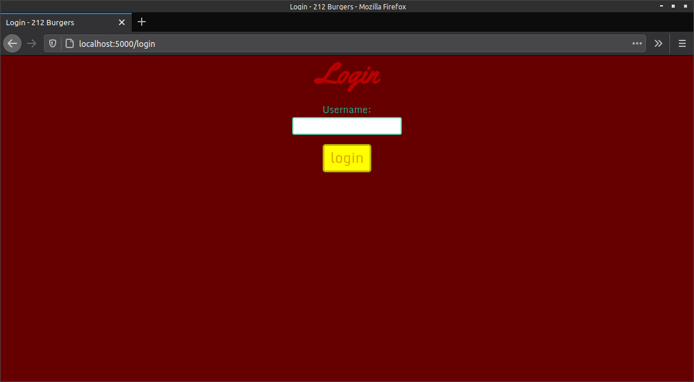
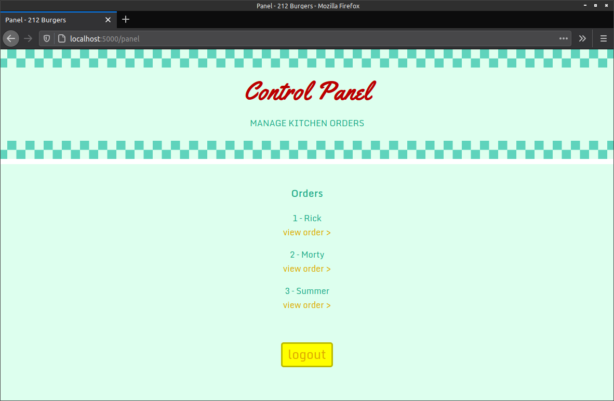
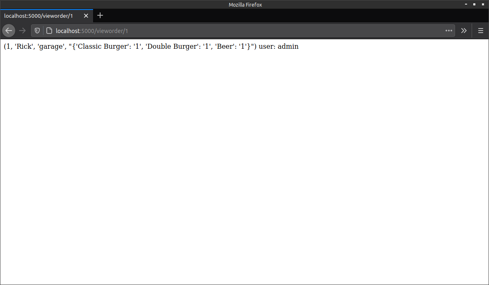
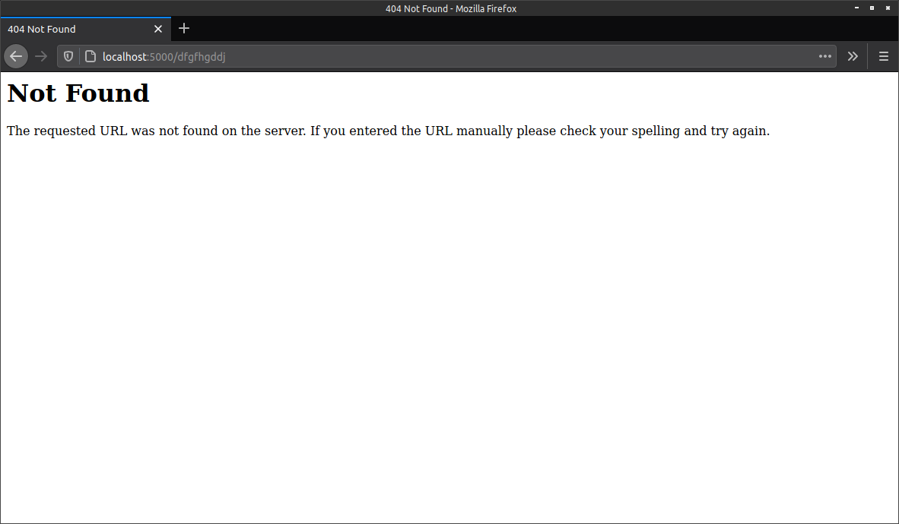

*289.212.05.workshop*

<!-- markdown-pdf -s md.css -h md.js notes.md -m '{"html":true}' -->

Sessions
========

A session object is a dictionary that contains key-value pairs of session variables and associated values. You'll use a session to manage user logins for 212 Burgers. 

Your lecturer/tutor will provide an introduction to sessions and important related concepts. You'll visit wikipedia.org and use your browser inspector to explore some cookie and session data, examining the different key-value pairs, some of which are encrypted.

Configuring a Secret Key
------------------------

Import the `session` module into your Flask app. At the same time, import `redirect` and `url_for`, which you'll require further along in this lesson. Flask uses a `secret_key` to sign cookies on the client-side cryptographically:

*run.py*
~~~python
from flask import Flask, render_template, request, session, redirect, url_for
import sqlite3

app = Flask(__name__)
app.secret_key = 'Sooooperd0000perS3cr3t'
~~~

The `secret_key` needs to be secure, something long and full of varied characters.

Adding a Panel for Managing Orders
----------------------------------

Next, you'll set up a panel for tracking orders. The idea is that some employee or chef can use this to monitor the incoming orders.

First, create a new *login.html* page (in the *templates* directory). Add the following code to this:

*login.html*
~~~html


Login - 212 Burgers



    <h1 class="center-text">Login</h1>

    <form action="/login" id="login" method="post">
      

        <label for="username">Username:</label> 
        <input type="text" id="username" name="username" autocomplete="off" required />
      

      
<input type="submit" value="login" class="btn-yellow" />

    </form>


~~~

Add a new route for the login page:

*run.py*
~~~python
...

@app.route('/login', methods=['GET', 'POST'])
def login():
    if request.method == 'POST' and request.form['username'] == 'admin':
        session['username'] = request.form['username']
        return redirect(url_for('panel'))
    else:
        return render_template('login.html')
~~~

To access the panel, the user must enter the username, *admin*. There's no password required. If you'd like to use passwords, you'll need to ensure that your website is appropriately secured -- a topic I don't cover in this course. The *login* button will redirect the browser to the panel webpage, which you've yet to define. If the user enters the username incorrectly, the *login* button redirects back to the same (login) page, so that the user may try again.

**Note** that the user must know the URL (http://localhost:5000/login) to access the login page (although, you could include a link to this somewhere on another page).

Next, create a template for the panel named *panel.html* with the following code: 

*panel.html*
~~~html


Panel - 212 Burgers


    {{ super() }}
    




    

      <h1>Control Panel</h1>
      
MANAGE KITCHEN ORDERS

    

    

      <h3>Orders</h3>

      
      

        {{ order[0] }} &ndash; {{ order[1] }} 
        <a href="/vieworder/{{order[0]}}">view order &gt;</a>
      

      

      
&nbsp;

      

        <a class="btn-yellow" href="/logout">logout</a>
      

    


~~~

Now add a new route for the panel page:

*run.py*
~~~python
...

@app.route('/panel')
def panel():
    orders = []
    if 'username' in session:
        con = sqlite3.connect(MENUDB)
        cur = con.execute('SELECT * FROM orders')
        for row in cur:
            orders.append(list(row))
        con.close()
        return render_template('panel.html', orders=orders)
    else:
        return render_template('login.html')
~~~

Open the login page in your browser (http://localhost:5000/login); log into the panel, which should look something like this:

I want to view each order in its own page. For this, I'll use the Flask [variable rules](https://flask.palletsprojects.com/quickstart/#variable-rules) feature to create routes using a variable path name dynamically. You'll come to understand how this works as you progress through the task.

Add the following route:

*run.py*
~~~python
...

@app.route('/vieworder/<order_id>')
def viewOrder(order_id):
    if 'username' in session:
        con = sqlite3.connect(MENUDB)
        cur = con.execute('SELECT * FROM orders WHERE id=?', (order_id,))
        order = cur.fetchone()
        con.close()
        return str(order) + ' user: ' + session['username']
    else:
        return redirect(url_for('login')) #render_template('login.html')
~~~

The `<order_id>` is replaced with whatever appears at the end of a URL. For example, for https://localhost/vieworder/1, `order_id` is equal to `1`. That value is passed into the `viewOrder()` function where it's used to query the database. 

Click on any order on the panel page to view the details. I haven't bothered with a template for the order details -- those appear in plain-text:

Finally, add a *logout* route that takes the user back to the home page, deleting the session in the process:

*run.py*
~~~python
...

@app.route('/logout')
def logout():
    if 'username' in session:
        session.pop('username', None)
    return redirect(url_for('index'))
~~~

Save and test out the logout button (it's on the panel page).

Redirects and errors
====================

If the user is directed to, or types in a missing path, Flask will display the following error page:

To customise this page, or redirect elsewhere, refer to the following documentation:

* https://flask.palletsprojects.com/quickstart#redirects-and-errors

That's as far as these lessons venture into creating a web app for a burger shop. You can add additional features using the skills you've learned in these lessons. For more information on Flask, you can refer to the official documentation. 

*end*
